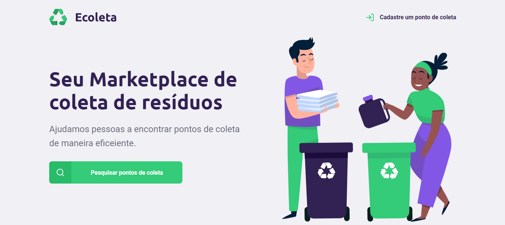

<h1 align="center">Ecoleta</h1>

Projeto que ajuda pessoas a encontrar pontos de coleta de materiais recicláveis em suas cidades, no Brasil

## Demo

  

## 🚀 Tecnologias

Esse projeto foi desenvolvido com as seguintes tecnologias:

- HTML5
- CSS3
- JavaScript
- Node.js
- Nunjucks
- Sqlite

## 💻 Projeto

Desenvolvido com base no evento NLW da Rocketseat.
